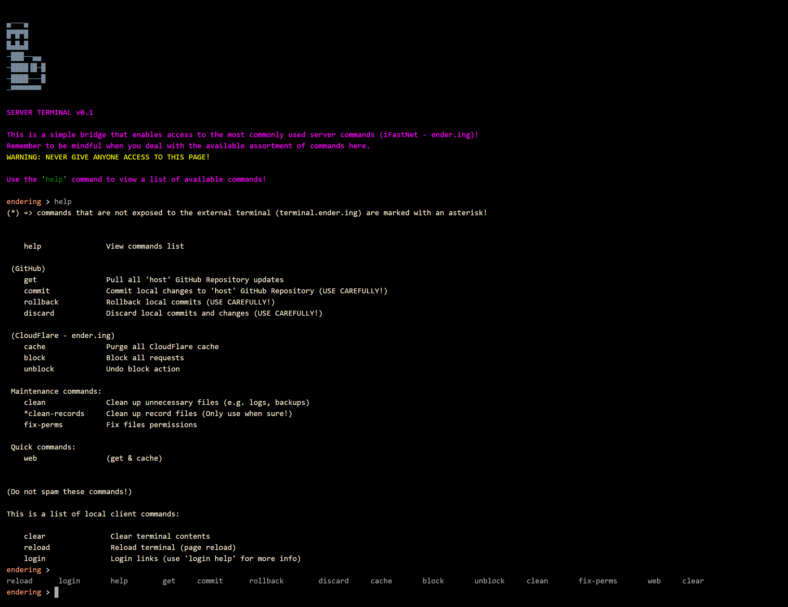

# Server Updates

> Last update: May 21st, 2024

In order to apply your local changes to the server, you must first use the [`BUILT.bat` command](https://github.com/Ender-ing/render-activity/blob/main/BUILD.bat) (***only on Windows***) to build a ready-to-host version of the codebase.

> Note that this documentation is meant to instruct individuals with access to the [server terminal](https://terminal.ender.ing/) and [private repositories](https://github.com/Ender-ing/#private-repositories)!

After the output of this command is generated, you should navigate to the output directory, and commit your changes to the [`host` GitHub Repository](https://github.com/Ender-ing/host/).

> If you do not have access to that repository, but still wish to contribute, you may ask the maintainers to accept your contribution in the dedicated public repository related to your contribution, so they may build a new host codebase.

After the commit is accepted, you may use the server terminal to publish the changes.

## Server Terminal

After logging into the [server terminal](https://terminal.ender.ing/), you may use the most fitting command to publish changes:



### Server-side changes

If the changes within the codebase only relate to server-side code, you may use the `get` command to fetch changes.

### Client-side changes

If the changes within the codebase affect client-side code (JavaScript, CSS, Display files, etc.), you may use the `web` command to fetch changes and purge the global cache.

> If you believe that the client-side changes are not large, or are not important, you may just use the `get` command, without purging the global cache.

## Versioning

By default, any changes to the codebase of a service/root directory will trigger a version increment.

If you wish to generate a new build without automatically updating the version of the codebase, you may use the `--no-update` flag:

```batch
BUILD.bat --no-update
```

If you wish to manually update all global versions (an example use case would be when a non-local shared resource is updated), you may use the following flags:

```batch
:: Increase major version by 1
BUILD.bat --major
:: Increase minor version by 1
BUILD.bat --minor
:: Increase patch version by 1
BUILD.bat --patch
```

If you wish to delete generated versioning files, you may use the [RESET-VERSION.bat](https://github.com/Ender-ing/render-activity/blob/main/RESET-VERSION.bat) command:

```batch
RESET-VERSION.bat
```

## Note

After the accounts system is completed, it is planned to provide staff with the ability to access the terminal and commit to GitHub using one account, and commands will become restricted according to the user's account permissions. For the time being, staff must use GitHub and *htpasswd* credentials!
